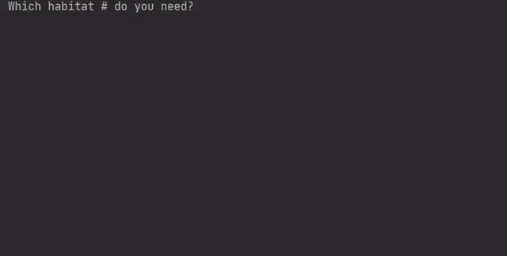

# Zookeeper
Print animals made with ASCII symbols.
https://hyperskill.org/projects/98

## Stages
---
__Stage 1: Rush into print__
First, letss try to get some simple output from your code.

__Stage 2: Show me an animal!__
Show the zookeeper an image of her ward

__Stage 3: What's insise?__
The zookeeper wants to know what is inside each habitat, by its number.

__Stage 4: Sustainable care__
Finally, your program is able to work for as long as needed!

